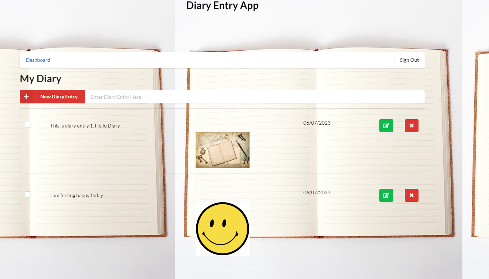

# Serverless diary

Hello Udacity Mentor, thank you for taking the time to review my project. I created a diary app where users can enter diary entries.

# Functionality of the application

Get - Fetches diarys I have implemented ordering so that the oldest creation date always appears first
Create - creates a diary entry
Update - can update diary entry
delete - can delete diary entry

The user also has the option to tick of each diary entry. This could be a box to tick off the fact theyve reflected on this entry.

# New features 
# 1. Travic CI
I know it wasnt part of the rubric for this project option but thought id implement backend being deployed via travisCI when pushed for fun of it

# 2. Email Sns Functionality
User has option to enter email and sign up to email updates for diary entries. When the user creates an entry they receive an email (screenshots attached)

# 3. pagination
Inputed pagination. Can change between 5,10,15. Also sorted functionality can be done for createdAt and dueDate (note dueDate could be changed to a variable more applicable to diary entry in future)

# Notes on deployment steps
1. push changes 
2. Then travis will run the steps automatically to sls deploy or you can do manually:
- cd backend
- npm update --save
- npm audit fix
- sls deploy --verbose --aws-profile serverless
2. grab endpoint from travis CI or manual deployment and enter into apiId in: client -> config
3. in client folder run 'npm run start' and app will open

# Screenshots of successes can be seen in screenshots
/screenshots includes - cloudformation stack, diary app homepage with it used, serverless app, successful sls deploy, travis ci success
, email sent for diary entry#

# Future improvements
1. Make tickbox feature advertised better for its use
2. have the full deployment proccess (including frontend) automated via travis CI. (as currently fetching apiId from travis then running frontend isnt best process)
3. change diary done, dueDate etc to other variables

Thank you!!

